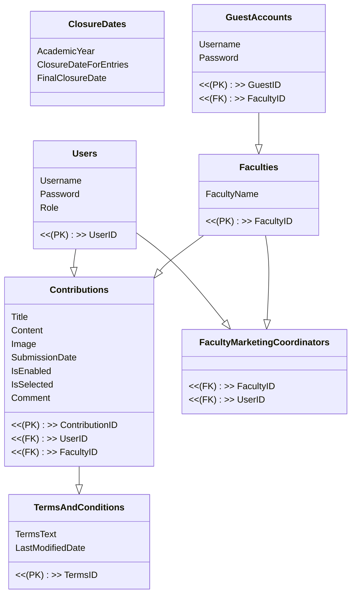

# Dataset README

## Overview

This dataset comprises several tables related to a university's academic contributions, user roles, faculties, terms and conditions, closure dates, and guest accounts. Below is an outline of the tables included in the dataset:

- Users Table: Stores information about users, including their username, password, role, and a unique UserID.
- Faculties Table: Contains details about university faculties, identified by a unique FacultyID.
- Contributions Table: Records academic contributions, including UserID and FacultyID foreign keys, title, content, image, submission date, and flags for enabling and selecting contributions.
- TermsAndConditions Table: Holds terms and conditions text along with the last modified date, identified by a unique TermsID.
- FacultyMarketingCoordinators Table: Establishes relationships between faculties and marketing coordinators (users).
- ClosureDates Table: Stores closure dates for academic years, including dates for entry closure and final closure.
- GuestAccounts Table: Manages guest accounts with their respective credentials and assigned faculty.

## Table Structure

## Usage

This dataset can be utilized for various purposes within an academic environment, including but not limited to:

- Managing user roles and permissions.
- Tracking academic contributions and their status.
- Defining terms and conditions for users.
- Specifying closure dates for academic activities.
- Managing guest accounts for external users.

## Contributors

**Nguyen Thai Manh**- @manhcode
